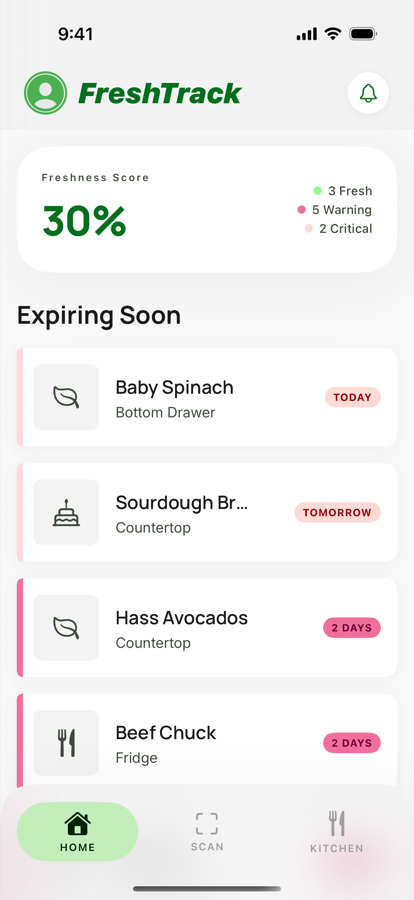
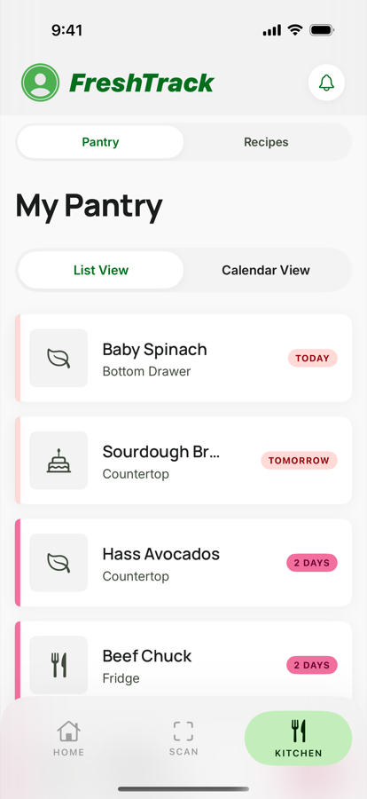
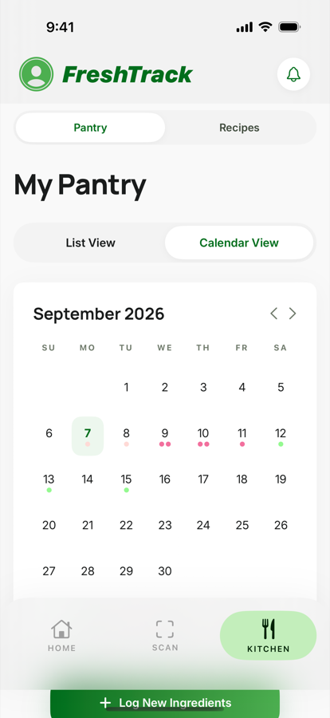
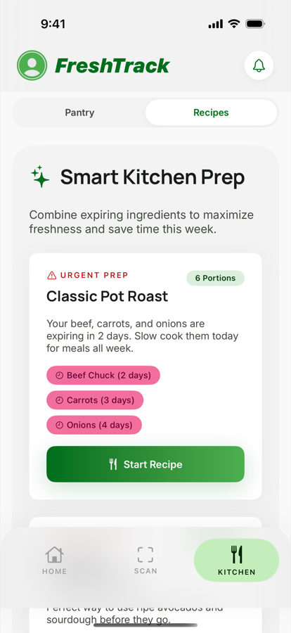

# FreshTrack — Smart Kitchen Manager

A SwiftUI iOS app that tracks food freshness, scans product barcodes, syncs expiry dates to Apple Calendar, sends local expiry reminders, and suggests batch cooking recipes using expiring ingredients.

## Architecture

| File | Purpose |
|---|---|
| `Theme.swift` | Full design system — colors, typography, radii, shadows, gradients, view modifiers (extracted from HTML/CSS) |
| `FoodItem.swift` | Data models: `FoodItem`, `Recipe`, `ShoppingItem`, enums, sample data |
| `FoodStore.swift` | Central `@ObservableObject` state manager — CRUD, batch logic, expiry scoring |
| `ScannerView.swift` | Two-step camera scanner: barcode, then the printed expiry date, then an editable confirm card |
| `ScannerViewModel.swift` | Scanner state machine (barcode → date → confirm), camera permission, typed/estimated date fallbacks, demo product lookup |
| `ScannerStepViews.swift` | Scan target, steps pill, date sheet, confirm card, camera notice |
| `DataScannerView.swift` | VisionKit `DataScannerViewController` host — barcodes and label text in one session |
| `ExpiryDateParser.swift` | Finds a printed best-before date in recognized text (numeric, ISO, month names, month-only stamps) |
| `ShelfLifeEstimator.swift` | Category shelf-life estimates for packages with no printed date; such items are tagged as estimated |
| `ContentView.swift` | Main tab navigation (Home / Scan / Kitchen) with glassmorphism nav bar |
| `HomeView.swift` | Dashboard with freshness score, expiring-soon list, quick actions |
| `PantryView.swift` | Inventory list / calendar toggle with add-item sheet |
| `CalendarGridView.swift` | Monthly grid with colored expiry dots and date-tap drill-down |
| `RecipesView.swift` | Batch cooking: recipes scored by 3+ expiring ingredients |
| `ShoppingListView.swift` | Checklist with add/delete/toggle |
| `CalendarManager.swift` | EventKit — adds all-day expiry events + 2-day-before alarms |
| `NotificationManager.swift` | UNUserNotificationCenter — 2-day-before local notifications |

## Frameworks Used

- **SwiftUI** — All UI
- **VisionKit** — Live barcode (EAN-8/13, UPC-E, Code 128, QR, etc.) and printed-date text recognition
- **AVFoundation** — Camera permission and torch
- **EventKit** — Calendar sync with 2-day-before alarm
- **UserNotifications** — Local push alerts 2 days before expiry

## Scanner flow

The barcode and the printed date are rarely on the same face of a package, so the
scanner runs as one camera session with two sequential states:

1. **Barcode** — one large bracket, hands-free auto-scan; the product name seeds the next step. "Skip to the date" handles loose produce; "Add manually" opens the entry sheet.
2. **Date** — the bracket becomes a text target and live text recognition parses the best-before stamp. The read date is shown for confirmation, never auto-saved. Fallbacks: type the date, or "No date printed", which proposes a category shelf-life estimate and tags the item as estimated.
3. **Confirm** — name, expiry, and placement are editable in place and the alert date is spelled out before saving.

## Design System: "The Culinary Atelier"

Extracted from the provided HTML/CSS assets with full Material Design 3 tonal palette:

- **Primary:** `#006E1C` (deep green) / Container: `#4CAF50`
- **Tertiary:** `#A63360` (rose) / Container: `#F26F9D`
- **Error:** `#BA1A1A` / Container: `#FFDAD6`
- **Typography:** Manrope (headlines) + Inter (body/labels)
- **Surfaces:** Tonal nesting — no hard borders, ambient shadows only
- **Nav bar:** 32px top radius, glassmorphism (ultra-thin material)

## Requirements

- iOS 17.0+
- Xcode 16+
- Physical device recommended (camera scanner)

## Setup

```bash
# Option A: XcodeGen
brew install xcodegen
cd iOS_app
xcodegen generate
open FreshTrack.xcodeproj

# Option B: Create Xcode project manually
# 1. New Xcode project → iOS App → "FreshTrack"
# 2. Copy all App/*.swift files into the project
# 3. Build & run on simulator or device
```

## Screenshots

Captured on an iPhone simulator by the UI-test walkthrough in CI (see [`docs/screenshots`](docs/screenshots)).

| Home | Pantry | Calendar | Recipes |
|---|---|---|---|
|  |  |  |  |

## Testing

Two test bundles are generated alongside the app by `xcodegen generate`:

| Target | What it covers |
|---|---|
| `FreshTrackTests` (XCTest) | `FoodItem` freshness bands and labels, `FoodStore` expiry queries / recipe scoring / shopping list, view models, and JSON persistence (using the in-memory double, so no prompts or disk writes) |
| `FreshTrackUITests` (XCUITest) | A full walkthrough on an iPhone simulator: Home → Pantry list → Calendar → Recipes → Shopping list → Scanner → context-menu delete, capturing a screenshot at every step |

Run everything locally on a booted iPhone simulator:

```bash
xcodegen generate
xcodebuild test -project FreshTrack.xcodeproj -scheme FreshTrack \
  -destination 'platform=iOS Simulator,name=iPhone 16 Pro'
```

To also dump the walkthrough screenshots as PNG files, set
`TEST_RUNNER_SCREENSHOT_DIR=/some/dir` in front of the `xcodebuild` command.

The same run happens automatically in CI on every push
([`.github/workflows/ios-simulator-tests.yml`](.github/workflows/ios-simulator-tests.yml));
screenshots and the `.xcresult` bundle are published as workflow artifacts.
